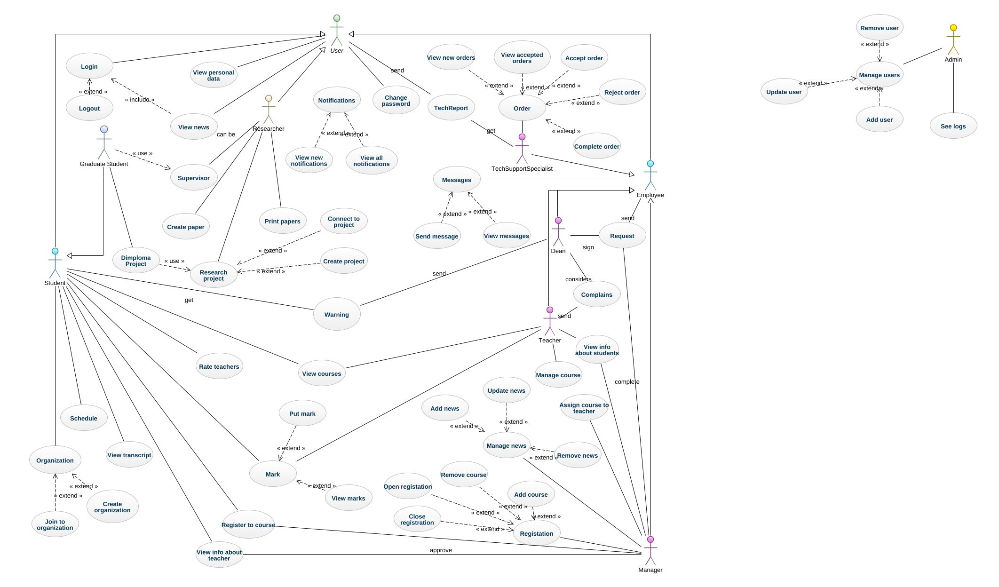
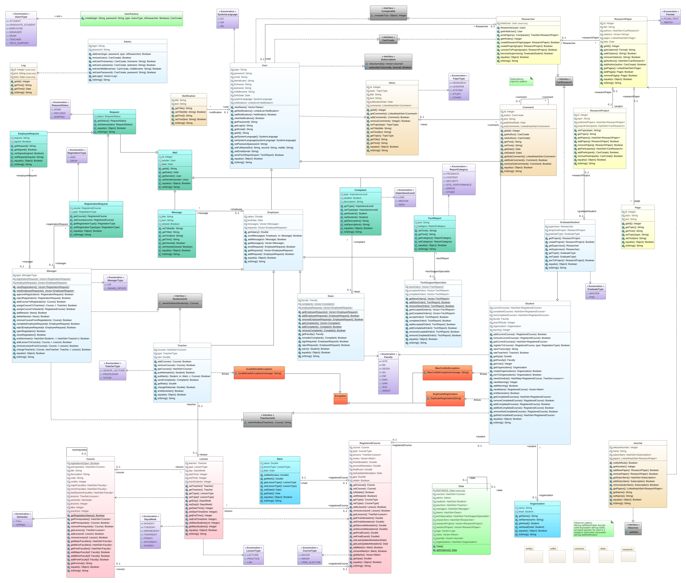

# OOP-project
This is the University Student Portal, a group project developed as part of the Object-Oriented Programming (OOP) course.

## Main Features

- **User Roles**: Supports different roles including students, teachers, and administrative staff.
- **Academic Records**: Allows students to view their grades and transcripts.
- **Course Registration**: Enables students to register for courses each semester.
- **Schedule Management**: Provides students and faculty with a personalized schedule of classes.
- **Teacher Evaluations**: Allows students to submit evaluations of their instructors.
- **Personal Data Management**: Users can view and update their personal information.
- **Administrative Tools**: Provides faculty and staff with tools to manage courses, students, and academic records.

## UML Diagrams

### Use Case Diagram

### Class Diagram

